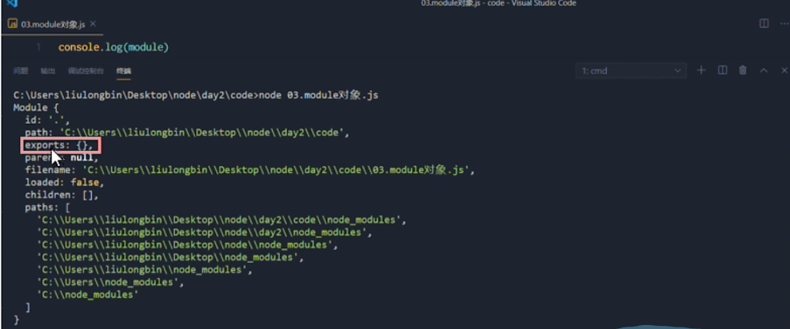

# 1. 模块化的基本概念
## 1.1. 什么是模块化?
> 1.现实生活中的模块化,相当于一辆车的各个零件,可以随时替换但不影响车子工作
## 1.2. 编程领域的模块化
> 1.将一个大文件拆分成独立并互相依赖的多个小模块

模块化的好处:
1. 提高代码复用
2. 提高代码的可维护性
3. 可以实现按需加载
# 2. nodejs中的模块化
## 2.1. nodejs中的模块类型
1. 内置模块(内置模块是由node.js官方提供的,例如fs,http,path等)
2. 自定义模块(用户创建的每个.js文件,都是自定义模块)
3. 第三方模块(由第三方开发出来的模块,使用前需要先下载)
## 2.2. 加载模块的方式
```js
// 1.加载内置模块
const fs = require('fs')
// 2.加载用户的自定义模块
const custom = require('./custom.js')
// 3.加载第三方模块
const comment = require('thirdpath')
```
## 2.3. 模块化作用域
> 在模块中定义的变量,其它模块无法访问,从而防止出现全局变量污染问题
## 2.4 向外共享模块作用域中的成员
1. modules对象: 在每个.js自定义模块中都有一个module对象,它里面存储和当前模块有关的信息

2. exports属性: 在自定义模块中,可以使用module.exports对象,将模块内的成员共享出去,供外界使用
## 2.5 exports详解
> 一般情况下,我们引入一个没有对外暴露的模块,那么将这个模块赋值给一个变量并且打印,会发现是一个空对象,这是因为引入的模块其实只是它的exports属性
1. nodejs提供了exports对象,默认情况下,exports和module.exports指向同一个对象.最终共享的结果,还是以module.exports指向的对象为准
## 2.6 nodejs模块化规范
> CommonsJS规定: 
1. 每个模块内部,**module**变量代表当前模块
2. module变量是一个对象,它的exports属性(即module.exports)是对外的接口
3. 加载某个模块,其实是加载改模块的module.exports属性,require()方法用于加载模块
# 3. npm与包
## 3.1 什么是包?
>  &nbsp;&nbsp;&nbsp;&nbsp;nodejs中的第三方模块又叫做包,就像电脑和计算机指的是相同的东西,第三方模块和包指的是用一个概念,只不过叫法不同
## 3.2 包的来源
> &nbsp;&nbsp;&nbsp;&nbsp;不同于nodejs内置模块与自定义模块,包是由第三方个人或团队开发出来的,供别人免费试用
## 3.3 为什么需要包
> &nbsp;&nbsp;&nbsp;&nbsp;由于nodejs的内置模块仅提供了一些底层API,导致在基于内置模块进行项目开发的时候,效率很低.包是基于内置模块封装出来的,提供了更高级、更方便的API,极大的提高了开发效率. \
&nbsp;&nbsp;&nbsp;&nbsp; 包和内置模块之间的关系,类似于jQuery浏览器内置API之间的关系
## 3.4 如何下载包
> [npm官网](https://www.npmjs.com/) 

1. npm初体验
    1. 下载一个格式化时间的包(moment)
    ```sh
    $ npm install moment
    ```
    2. 使用require()导入格式化时间的包
    ```js
    const moment = require('moment')
    ```
    3. 参考moment的官方API文档对时间进行格式化 \
    [参考文档](http://momentjs.cn/docs/#/parsing/string/)
2. node_modules \
&nbsp;&nbsp;&nbsp;&nbsp;初次装包完成后,在项目文件夹下多了一个叫做node_modules的文件夹和package-lock.json的配置文件 其中:  \
- **node_modules**用来存放已安装到项目中的包.require()导入第三方包时,就是从这个目录中查找并加载包
- **package-lock.json**配置文件用来记录node_modules目录下的每一个包的下载信息,例如包的名字、版本号、下载地址等
- `注意: 程序员不要手动修改node_modules或packge-lock.json文件中的任何代码,npm包管理工具会自动维护它们.
3. 安装指定版本号
```sh
npm install moment@2.22.2
```
4. 包的命名规范
> 例如包的版本号 2.22.2
- 第一位数字: 大版本更新
- 第二位数字: 功能版本
- 第三位数字: Bug修复版本
## 3.5 包管理配置文件
npm规定,在项目根目录中,必须提供一个叫做package.json的包管理配置文件.用来记录与项目有关的一些配置信息,例如:
- 项目的名称、版本号、描述等
- 项目中都用到了哪些包
- 哪些包只在开发期间会用到
- 哪些包在**开发**和**部署**时会用到 

1.快速创建package.json文件
```sh
$ npm init -y
```
`注意: `
1. 上述命令只能在英文的目录下成功运行!,所以,项目文件夹的名称一定要使用英文命名,不要使用中文,不能出现空格
2. 运行 npm install命令安装包的时候,npm管理工具会自动把包的名称和版本号,记录到package.json中 

2.dependencies节点
> pageckage.json文件中,有一个dependencies节点,专门用来记录你使用 npm install 命令安装了哪些包

3.卸载包
```sh
$ npm uninstall 包名字
```
> 改命令执行成功后,会把卸载的包,自动从package.json的dependencies中移除掉
## 3.6 按照工作环境下载包
1. devDependencies节点: 如果有些包**只在项目开发阶段**会用到,在项目上线之后不会用到,则建议把这些包记录到devDependencies节点中与之对应的,如果某些包在**开发**和**项目上线**之后都会用到,则建议把这些包记录到dependencies节点中
2. 下载包并记录到devDependencies节点命令
```sh
$ npm i 包名 -D 
或
$ npm i 包名 --save-dev
```
## 3.7 解决下包速度慢的问题
1. 切换npm的下包镜像源
```sh
# 查看当前的下包镜像源
$ npm config get registry
```
2. 将下包的镜像源切换到淘宝镜像源
```sh
npm config set registry = https://registry.npmmirror.com/
```
## 3.8 解决下包速度慢的问题(方式2)
> 为了更方便的切换下载包的镜像源,我们可以安装nrm工具,利用nrm提供的终端命令,可以快速查看和切换下载包的镜像源
```sh
# 通过npm包管理工具,将nrm安装为全局可用的工具
npm i nrm -g
# 查看所有可用的镜像源
nrm ls
# 将下包的镜像源切换为taobao镜像
nrm use taobao
```
## 3.9 包的分类
1. 项目包 
> &nbsp;&nbsp;&nbsp;&nbsp;那些被安装到项目的node_modules目录中的包,都是项目包. \
项目包又分为两类,分别是: 
- 开发依赖包(被记录到**devDependencies**节点中的包,只在开发期间会用到)
```sh
$ npm i 包名 -D
```
- 核心依赖包(被记录到**dependencies**节点中的包,在开发期间和项目上线之后都会用到)
```sh
$ npm i 包名 
```
2. 全局包 
> &nbsp;&nbsp;&nbsp;&nbsp;在执行 npm install 命令时,如果提供了 -g 参数,则会把包安装为全局包 \
&nbsp;&nbsp;&nbsp;&nbsp;使用 `npm root -g` 命令查看全局包的安装位置
```sh
$ npm i 包名 -g #全局安装指定的包
$ npm uninstall 包名 -g #卸载全局安装的包
```
`注意`:  
    1. 只有工具性质的包,才有全局安装的必要性.因为它们提供了好用的终端命令 \
    2. 判断某个包是否需要全局安装后才能使用,可以参考官方提供的使用说明即可 

## 3.10 i5ting_toc全局包的下载与使用
> i5ting_toc是一个可以把md文档转为html页面的小工具,使用步骤如下
```sh
$ npm install -g i5ting_toc
$ i5ting_toc -f md文件路径 -o
```
# 3.11 规范包的结构
`一个规范的包,它的组成结构,必须符合以下3点要求:`
1. 包必须以单独的目录存在
2. 包的顶级目录要必须包含package.json这个包管理配置文件
3. package.json中必须包含name,version,main三个属性,分别代表包的名字、版本号、包的入口
## 3.12 开发自己的包
1. 编写包需要实现的功能
2. 初始包的结构
    1. 新建tools文件夹,作为包的根目录
    2. 在tools文件夹中,新建如下三个文件:
    - package.json(包管理配置文件
    - index.js(包的入口文件)
    - README.md(包的说明文档)
3. 初始化package.json文件
4. 将不同功能进行模块化拆分
    1. 将格式化时间的功能拆分到 src-> dateFormat.js中
    2. 将处理html字符串的功能,拆分到 src-> htmlEscape.js中
    3. 在index.js中,导入两个模块,得到需要向外共享的方法
    4. 在index.js中,使用module.exports把对应的方法共享出去
5. 发布包
    1. 注册npm账号
    2. 登录账号
    ```sh
    $ npm login
    ```
    `注意:` 在运行npm login 命令之前,必须把下包的服务器地址切换为npm的官方服务器.否则会导致发布包失败

    3. 发布 
    > 在tools文件夹下,输入下面命令
    ```sh
    $ npm publish
    ```
    `注意:` 包名不能雷同

    4. 删除已经发布的包
    ```sh
    $ npm unpublish 包名 --force
    ```
    `注意:` 
    - 如果发布的包已经超过72小时,那么就不能删除了
    - 对于已经删除的包,在删除的24小时以内不允许重复发布
## 3.12 模块加载机制
&nbsp;&nbsp;&nbsp;&nbsp; 优先从缓存中加载
> 模块在第一次加载后会被缓存.这也意味着多次调用require不会导致模块的代码被多次执行

`注意:不论是内置模块、用户自定义模块、还是第三方模块,它们都会优先从缓存中加载,从而提高模块的加载效率` \
&nbsp;&nbsp;&nbsp;&nbsp;如果第三方包叫fs,那么require('fs')会加载nodejs内置的fs模块,因为在nodejs中,内置模块的加载优先级最高 \
&nbsp;&nbsp;&nbsp;&nbsp;使用require()加载自定义模块时,必须指定以 ./ 或 ../开头的路径标识符.在加载自定义模块时,如果没有指定 ./或../这样的路径标识符,则node会把它当作内置模块或第三方模块进行加载 \
&nbsp;&nbsp;&nbsp;&nbsp;在require()导入自定义模块时,如果省略了文件的扩展名,则Node.js会按顺序分别尝试加载一下文件:
1. 按照确切的文件名进行加载
2. 补全.js扩展名进行加载
3. 补全.json扩展名进行加载
4. 补全.node扩展名进行加载
5. 加载失败,终端报错

&nbsp;&nbsp;&nbsp;&nbsp;第三方模块的加载机制如图所示:

&nbsp;&nbsp;&nbsp;&nbsp;将目录作为模块: 当把目录作为模块标识符,传递给require()进行加载的时候,有三种方式:
1. 在被加载的目录下查找一个叫做package.json的文件,并寻找main属性,作为require()加载的入口
2. 如果目录里没有package.json文件,或者main入口不存在或无法解析,则Node.js将会试图加载目录下的index.js文件
3. 如果以上两步都失败了,则Node.js会在终端打印错误信息.