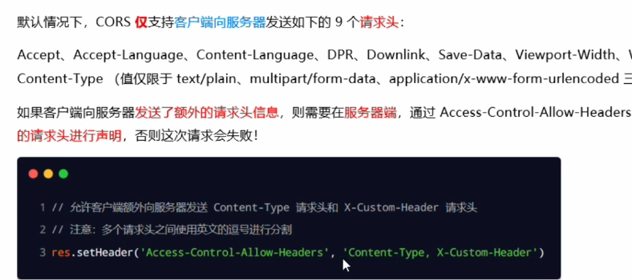

# 1.什么是路由?
> 客户端的请求与服务器处理函数之间的映射关系,包括`请求的类型`、`请求的URL地址`、`处理函数`
# 2.路由的匹配过程
> 每当一个请求到达服务器后,需要先经过路由的匹配,只有匹配成功后,才会调用对应的处理函数.
# 3.模块化路由
> 为了`方便对路由进行模块的管理`,Express不建议将路由直接挂载到app上,而是推荐将路由抽离为单独的模块
1. 创建路由模块对应的.js文件
2. 调用express.Router()函数创建路由对象
3. 向路由对象上挂载具体的路由
4. 使用module.exports向外共享路由对象
5. 使用app.use()函数注册路由模块
# 4.中间件的概念
> 上面案例中的路由就相当于中间件,特指业务流程的中间处理环节,上一级的输出作为下一级的输入.
## 4.1 中间件的格式(类似过滤器,用到了责任链模式)

`注意:`next函数是实现多个中间件连续调用的关键,它表示把流转关系转交给下一个中间件或路由
## 4.2 全局生效的中间件
> 当客户端发起的任何请求都会先经过中间件再进入路由进行处理.
1. 全局中间件的写法 `4-express-中间件.js`
## 4.3 中间件的作用

## 4.4 定义多个全局中间
> 可以使用app.use()连续定义多个全局中间件,客户端请求到达服务器之后,会按照中间件定义的先后顺序一次进行调用,实例代码.

## 4.5 局部生效的中间件
> 不使用app.use()定义的中间件,叫做局部生效的中间件
## 4.6 定义多个局部中间件

## 4.7 中间件的注意事项
1. 一定要在路由注册之前注册自定义中间件
2. 客户端发送请求,可以连续调用多个中间件进行处理
3. 执行完中间件的业务代码之后,不要忘记调用next()函数
4. 为了防止代码逻辑混乱,调用next()函数后不要再写额外的代码
5. 连续调用多个中间件时,多个中间件之间,共享req和res对象
## 4.8 中间件分类
1. 应用级别的中间件

2. 路由级别的中间件

3. 错误级别的中间件

4. Express内置中间件 \
代码: `6-express-内置中间件.js`(重要)

5. 第三方的中间件

# 4.9 自定义中间件
1. 需求描述与实现步骤
> 自己手动模拟一个类似于express.urlencoded这样的中间件,来解析POST提交到服务器的表单数据
实现步骤: \
    1. 定义中间件 \
    2. 监听req的data事件 \
    3. 监听req的end事件 \
    4. 使用querystring模块解析请求体数据 \
    5. 将解析出来的数据对象挂载为req.body \
    6. 将自定义中间件封装为模块
# 5. 自己写接口
1. 跨域问题
> 使用cors中间件解决

cors 是Express的一个第三方中间件.通过安装和配置cors中间,可以很方便解决跨域问题.
1. 下载
```sh
$ npm install cors
```
2. 导入
```js
const cors = require('cors')
```
3. 使用
```js
app.use(cors())
```
# 6. CORS响应头
1. 限制访问服务器资源的外域URL(Access-Control-Allow-Origin)
```js
// 服务器接口只允许来自 http://lidengxiang.cn 的请求访问
res.setHeader('Access-Control-Allow-Origin','http://lidengxiang.cn')
// 服务器允许来自任何域的请求访问接口
res.setHeader('Access-Control-Allow-Origin','*')
```
2. 发送额外的请求头信息(Access-Control-Allow-Headers)
```js
res.setHeader('Access-Control-Allow-Headers','Content-Type,X-custom-Header')
```

3. 允许的请求方式(Access-Control-Allow-Methods)
> &nbsp;&nbsp;&nbsp;&nbsp;默认情况下,CORS仅支持客户端发起GET,POST,HEAD请求 \
&nbsp;&nbsp;&nbsp;&nbsp;如果客户端希望通过PUT,DELETE等方式请求服务器的资源,则需要在服务器端,通过Access-Control-Allow-Methods来指明实际请求允许使用的HTTP方法.

